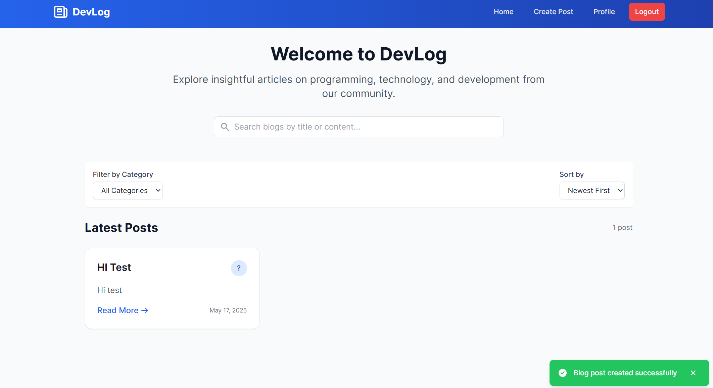

# DevLog

A modern blog platform for developers to share their knowledge, experiences, and insights.

## Features

### User Experience
- **Responsive Design**: Fully responsive layout works on desktop, tablet, and mobile devices
- **Modern UI/UX**: Clean, intuitive interface with Tailwind CSS styling
- **Toast Notifications**: Real-time feedback for user actions
- **Confirmation Dialogs**: Prevent accidental deletions with confirm modals

### Content Management
- **Rich Blog Editor**: Create and edit blog posts with a user-friendly interface
- **Image Upload**: Add images to your blog posts with drag-and-drop functionality
- **Blog Management**: Create, read, update, and delete your own blog posts
- **Content Preview**: Preview your blog post before publishing

### Discovery & Navigation
- **Search Functionality**: Find blogs by content or title
- **Category Filtering**: Filter blogs by categories
- **Sorting Options**: Sort blogs by date or alphabetically
- **Pagination**: Navigate through blog listings with pagination controls

### User Account
- **User Authentication**: Secure login and registration system
- **User Profiles**: View and manage your profile and blog posts
- **Protected Routes**: Secure routes requiring authentication

## Tech Stack

### Frontend
- **React**: UI library for building component-based interfaces
- **Tailwind CSS**: Utility-first CSS framework for styling
- **Axios**: Promise-based HTTP client for API requests
- **React Router**: Navigation and routing solution
- **Context API**: State management for authentication

### Backend
- **Node.js**: JavaScript runtime for server-side code
- **Express**: Web framework for Node.js
- **MongoDB**: NoSQL database for data storage
- **JWT**: JSON Web Tokens for authentication
- **Bcrypt**: Password hashing for security

